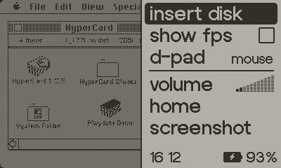

# Mini vMac for Playdate

Port of Mini vMac to the Panic Playdate console. It's not very usable due to slowness and limited input.


## Features

* Emulates a Macintosh Plus at half its speed, or slower.
* Screen matching the Playdate (400×240). This is smaller than any Macintosh, which will break some software.
* Draws screen at around 4 fps.
* No sound.
* Controls:
	* D-pad: mouse movement or WASD (set in menu)
	* A button: mouse button
	* B button: space bar
	* Crank: arrow up/down
* Load `vMac.rom` and disk images from `Data/net.namedfork.minivmac`
* Press the menu button to switch input modes or insert disks



## Installation


* Build or download `minivmac.pdx` from [releases](https://github.com/zydeco/minivmac4playdate/releases).
* Copy `minivmac.pdx` to the Playdate's `Games` directory, or sideload it [from the web](https://play.date/account/sideload/).
* Copy `vMac.rom` and any disk images to the Playdate's `Data/net.namedfork.minivmac` directory (create it if it doesn't exist).


## Building

Requires installing the [Playdate SDK](https://play.date/dev/), and having the `PLAYDATE_SDK_PATH` environment variable set.

### Device

* Create a build directory and initialize it 

```
mkdir build.dev
cd build.dev
cmake -DCMAKE_TOOLCHAIN_FILE=$PLAYDATE_SDK_PATH/C_API/buildsupport/arm.cmake -DCMAKE_BUILD_TYPE=Release ..
make
```

* `minivmac.pdx` will be built in the root directory

### Simulator (Xcode on macOS)

* Create a build directory and initialize it 

```
mkdir build.sim
cd build.sim
cmake .. -G Xcode -D CMAKE_C_COMPILER=cc
```

* An Xcode project `minivmac.xcodeproj` will be generated
* You can open and run this from Xcode

## Credits

* Mini vMac for Playdate by [Jesús A. Álvarez](https://github.com/zydeco)
* [Mini vMac](http://gryphel.com/c/minivmac/) ©2001-2021 Paul C. Pratt
* [vMac](http://vmac.org/) ©1996-1999 Philip Cummins & al.
